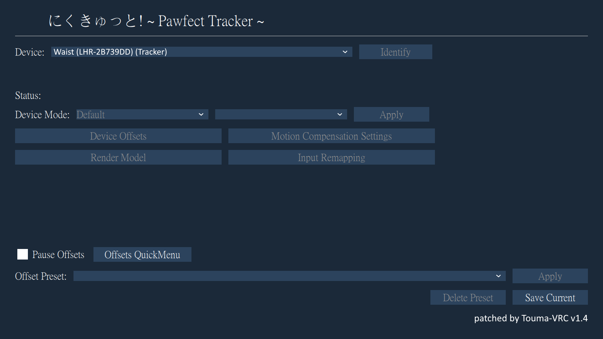
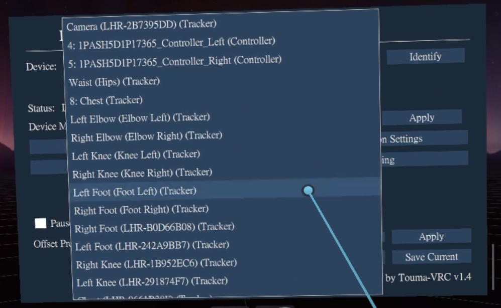
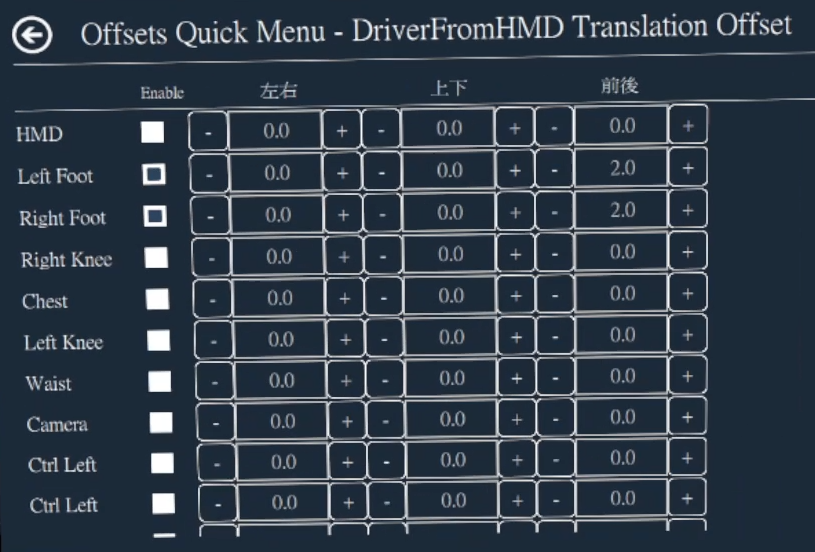

# にくきゅっと! ~ Pawfect Tracker ~

**SteamVR / VRChat フルボディトラッキング (FBT) 調整ツール**
**SteamVR / VRChat full-body tracking calibration tool**

[**📦 Download on Booth**](https://touma-vrc.booth.pm/) · [**💻 GitHub**](https://github.com/touma-tw)

[English](#english) · [日本語](#日本語)

---

## English
### Pawfect Tracker
Originally based on OpenVR-InputEmulator and actively maintained for modern SteamVR and VRChat environments.

### Overview
Pawfect Tracker is an open-source VR tracking utility designed to improve full-body tracking workflows for SteamVR and VRChat users.

This project continues development of an older tracking solution that had become largely unmaintained. The goal of Pawfect Tracker is to preserve compatibility with modern VR ecosystems, improve usability, and provide features that the community actually needs in daily use.

### Why This Project Exists
Many VR tracking tools were created years ago and gradually stopped receiving updates as SteamVR, OpenVR, and related software evolved.

As a result, users often encounter:
- Compatibility issues with newer SteamVR versions
- Outdated OpenVR integrations
- Long-standing bugs that were never addressed
- Missing quality-of-life features

Pawfect Tracker aims to solve these problems by providing an actively maintained alternative that remains compatible with modern VR environments.

### Key Improvements

Compared to the original project, Pawfect Tracker includes:
- Updated OpenVR integration
- Compatibility improvements for modern SteamVR versions
- Bug fixes for long-standing issues
- Quality-of-life enhancements requested by users
- Ongoing maintenance and support
- Improved stability and usability

### Target Users
Pawfect Tracker is intended for:
- VRChat users
- Full-body tracking enthusiasts
- SteamVR users
- Experimental VR hardware setups
- Developers working with OpenVR-based tracking systems

### Project Goals
The long-term goals of this project are:
- Preserve a valuable community tool
- Maintain compatibility with future SteamVR releases
- Improve reliability for everyday use
- Reduce setup complexity
- Continue adding features requested by users

## Project Status
✅ Actively Maintained
Compatible with:
- SteamVR (current versions)
- Vive Tracker 1.0 / 2.0 / 3.0
- VRChat FBT
- Meta Quest2/3 + Space Calibrator setups
- SteamFrame + Space Calibrator setups (future)
- FluxPose (future)

### What this is
A fork of OpenVR-InputEmulator with a new **HMD-relative tracker offset** system designed for VRChat full-body tracking calibration.

In the original tool, tracker offsets are specified in raw X / Y / Z driver-space axes. That works fine for developers, but for a player who just wants to move a foot tracker "10cm forward," it requires trial-and-error because X, Y, Z don't correspond to "forward" or "right" from the player's point of view.

This fork repurposes the existing third offset family (now called "DriverFromHMD Translation Offsets") so that:

- **左右 (Left/Right)** — based on which way the HMD is facing horizontally at the moment you set the value.
- **上下 (Up/Down)** — independent of whether you are looking up or down. Always world up.
- **前後 (Forward/Back)** — based on where the HMD is facing horizontally.
- The offset is **frozen into the tracker at the moment you enter it**, so after setting it, the offset behaves like a rigid attachment to the tracker. HMD turning does NOT make the tracker swing around; only the tracker itself moving or rotating affects the offset's world position.

### Features added on top of the parent fork

- **HMD-relative offsets** — what you see above. Set in `Device Offsets > DriverFromHMD Translation Offsets`.
- **Offsets Quick Menu** — single screen showing all trackers with editable 左右 / 上下 / 前後 offsets. No more clicking into each tracker one at a time.
- **Device role labels** — trackers show their role name (`Waist (Hips)`, `Left Foot`, `Right Knee`, etc.) instead of bare serial numbers like `LHR-2B7395DD`.
- **One-click save / load** — save the offsets of all currently-connected trackers as a named preset, and load them back later. Useful for switching between avatars or play styles (sitting / dancing / VRChat full-body events).
- **Pause Offsets** — temporarily disable all offsets in one click. Useful when doing a T-Pose calibration in VRChat and then re-enabling offsets afterward.

### Requirements

- Windows 10 / 11 (64-bit)
- SteamVR
- A SteamVR-compatible HMD (tested with Meta Quest 3 streamed via PC Link)
- Vive Trackers (1.0 / 2.0 / 3.0) on lighthouse base stations
- If your HMD is not on lighthouse, install [OpenVR-SpaceCalibrator](https://github.com/pushrax/OpenVR-SpaceCalibrator) to align your HMD and tracker coordinate spaces.

### Installation

1. **Quit SteamVR completely** (including the SteamVR Status icon in your system tray — right-click → Quit SteamVR).
2. Download the latest installer from [Booth](https://touma-vrc.booth.pm/) or [GitHub Releases](../../releases).
3. Run the installer as administrator. Follow the wizard.
4. The installer registers the OpenVR driver and SteamVR overlay automatically. No manual steps needed.
5. Start SteamVR. The overlay icon appears in the SteamVR dashboard.

### Quick usage

1. Open the overlay from the SteamVR dashboard.
2. Pick a tracker from the **Device** dropdown (now shows role names like "Left Foot" instead of serial numbers).
3. Click **Device Offsets**, then check **Enable Offsets** at the top.
4. In the **DriverFromHMD Translation Offsets** section, enter a value for 左右 / 上下 / 前後. The values are interpreted relative to where your HMD is facing right now.
5. Once it looks right, go back and click **Save Current** in the **Offset Preset** section to save the configuration of all currently-connected trackers under a chosen name.
6. To apply that preset later, choose it from the dropdown and click **Apply**.

For mass-adjusting multiple trackers, click **Offsets QuickMenu** to see all trackers at once.

### Tips

- Always run a T-Pose calibration in VRChat **first**, then enable offsets. If your offsets are already on when you T-Pose, the offset values themselves become part of the calibration.
- When the calibration is off and you want to redo a T-Pose, click **Pause Offsets** so all offsets are temporarily disabled, T-Pose normally, then uncheck Pause Offsets.
- If you re-run Space Calibrator after setting offsets, you must re-apply the preset. The old frozen offset values were computed against the previous space calibration and are now slightly off.
- Numerical input units are **centimeters**. So `2.0` = 2cm.

### Screenshots

*Main interface with Pause Offsets, Quick Menu, and Save/Load preset controls*

*Device dropdown showing role-based labels (Waist, Foot, Knee, etc.) instead of bare serials*

*Offsets Quick Menu — adjust all trackers' 左右 / 上下 / 前後 offsets in one screen*

### Differences from the parent fork

The driver-side change is small: the third offset family is now interpreted in the HMD's yaw frame, baked into the tracker's local coordinate system at the moment of input. The other two offset families (`WorldFromDriver Offsets` and `DriverFromHead Offsets`) work as before. UI additions: Quick Menu, save/load preset, Pause Offsets, role-based device labels, 左右/上下/前後 axis labels.

### Maintenance History
The original project had seen limited maintenance for an extended period.
Pawfect Tracker was created to continue development, restore compatibility with modern VR software, and ensure that users could continue relying on this tool as SteamVR and OpenVR evolved.
Since taking over maintenance, development has focused on:
* Updating dependencies
* Modernizing OpenVR support
* Resolving compatibility issues
* Improving user experience
* Addressing community feedback

This project represents an ongoing commitment to keeping an important VR community tool alive and usable.

### License

GNU General Public License v3.0. Same as the original OpenVR-InputEmulator. See `LICENSE` and `NOTICE.txt` for the full text and the list of modifications.

### Credits

- **Original work**: [OpenVR-InputEmulator](https://github.com/matzman666/OpenVR-InputEmulator) by matzman666
- **Parent fork**: [OpenVR-InputEmulator-Fixed](https://github.com/Erimelowo/OpenVR-InputEmulator-Fixed) by Erimelowo (the matzman666 original no longer builds against current SteamVR; this fork is based on Erimelowo's modernized version)
- **This fork**: by Touma-VRC, 2026
- Inspired by the needs of the VRChat FBT community.

---

## 日本語

### このソフトについて

OpenVR-InputEmulator のフォークです。**HMD相対オフセット**機能を新たに搭載し、VRChat のフルボディトラッキング (FBT) 校正を直感的に行えるようにしました。

オリジナル版では、トラッカーのオフセットは生の X / Y / Z (ドライバ空間の軸) で指定する必要があります。これは開発者向けには適切ですが、プレイヤーが「足のトラッカーを 10cm 前に動かしたい」と思った時には、X・Y・Z が「前」「右」と一致しないので試行錯誤になります。

本フォークでは、三番目のオフセット項目 (新しく「DriverFromHMD Translation Offsets」と命名) を以下のように解釈し直しました:

- **左右** — 値を入力した瞬間の HMD の水平方向の向きを基準にした左右。
- **上下** — 上を向いていても下を向いていても、常にワールドの真上方向。
- **前後** — 値を入力した瞬間の HMD の水平方向の向きを基準にした前後。
- オフセット値は**入力した瞬間にトラッカーに焼き込まれます**。設定後は、オフセットがトラッカーへの剛体取り付けのように振る舞います。HMD を回してもトラッカーは追従しません。トラッカー自身が移動または回転した時のみ、オフセット位置はそれに付いて動きます。

### 親フォークからの追加機能

- **HMD相対オフセット** — 上記の通り。`Device Offsets > DriverFromHMD Translation Offsets` で設定。
- **Offsets Quick Menu** — 全トラッカーの 左右 / 上下 / 前後 オフセットを一画面で編集できます。各トラッカーへ個別に入り直す必要はもうありません。
- **デバイス役割表示** — `LHR-2B7395DD` のような生のシリアル番号ではなく、`Waist (Hips)`、`Left Foot`、`Right Knee` などの役割名で表示されます。
- **ワンクリック保存・読み込み** — 現在接続中の全トラッカーのオフセットを名前付きプリセットとして保存し、後で一括で復元できます。アバターや遊び方 (座って遊ぶ / ダンス / VRChat FBT イベント) ごとの切り替えに便利です。
- **Pause Offsets** — 全てのオフセットを一時的に無効化できます。VRChat の T-Pose キャリブレーション時に便利です。

### 動作環境

- Windows 10 / 11 (64-bit)
- SteamVR
- SteamVR 対応 HMD (Meta Quest 3 を PC Link でストリーミング接続して動作確認済み)
- ライトハウスベースステーション上の Vive Tracker (1.0 / 2.0 / 3.0)
- HMD がライトハウス系でない場合は、[OpenVR-SpaceCalibrator](https://github.com/pushrax/OpenVR-SpaceCalibrator) を導入して HMD とトラッカーの座標系を合わせてください。

### インストール手順

1. **SteamVR を完全に終了してください** (タスクトレイの SteamVR Status アイコンも右クリックして Quit SteamVR を選択)。
2. [Booth](https://touma-vrc.booth.pm/) または [GitHub Releases](../../releases) から最新のインストーラをダウンロード。
3. 管理者権限でインストーラを実行し、ウィザードに従ってください。
4. OpenVR ドライバと SteamVR オーバーレイは自動的に登録されます。手動設定は不要です。
5. SteamVR を起動。SteamVR ダッシュボードにオーバーレイのアイコンが表示されます。

### 基本的な使い方

1. SteamVR ダッシュボードからオーバーレイを開きます。
2. **Device** ドロップダウンからトラッカーを選択 (シリアル番号ではなく「Left Foot」などの役割名で表示されます)。
3. **Device Offsets** をクリックし、上部の **Enable Offsets** にチェックを入れます。
4. **DriverFromHMD Translation Offsets** セクションで、左右 / 上下 / 前後 に値を入力します。値は入力した瞬間の HMD の向きを基準に解釈されます。
5. 設定が満足できる状態になったら、画面を戻って **Offset Preset** セクションの **Save Current** をクリック。任意の名前で、現在接続中の全トラッカーの設定をプリセットとして保存します。
6. 後でそのプリセットを適用するには、ドロップダウンから選択して **Apply** をクリック。

複数のトラッカーをまとめて調整したい場合は、**Offsets QuickMenu** をクリックして一画面で全トラッカーを確認・編集できます。

### コツ

- まず VRChat 側で T-Pose キャリブレーションを**先に**実施し、その後にオフセットを有効化してください。先にオフセットが入った状態で T-Pose を取ると、オフセット自体がキャリブレーションに含まれてしまいます。
- T-Pose をやり直したい場合は **Pause Offsets** をクリックすると全オフセットが一時無効になります。T-Pose 完了後、Pause Offsets のチェックを外せば復帰します。
- オフセット設定後に Space Calibrator を再キャリブレーションした場合は、プリセットを再 Apply してください。古いオフセット値は以前の空間キャリブレーションに基づいて計算されているため、ズレが発生します。
- 数値の単位は **センチメートル** です。例えば `2.0` は 2cm です。

### スクリーンショット

*メイン画面: Pause Offsets、Quick Menu、プリセットの保存/読み込み機能*

*デバイス選択ドロップダウン: シリアル番号ではなく役割名 (Waist / Foot / Knee など) で表示*

*Offsets Quick Menu — 全トラッカーの 左右 / 上下 / 前後 オフセットを一画面で調整*

### 親フォークからの違い

ドライバ側の変更は小さいです。三番目のオフセット項目が HMD のヨー (水平方向の向き) を基準に解釈され、入力した瞬間にトラッカーのローカル座標系に焼き込まれるようになりました。他の二種類のオフセット (`WorldFromDriver Offsets` と `DriverFromHead Offsets`) は従来通り動作します。UI 追加機能: Quick Menu、保存・読み込みプリセット、Pause Offsets、役割ベースのデバイス表示、左右/上下/前後 の軸ラベル。

### ライセンス

GNU General Public License v3.0。オリジナル版と同じです。全文と変更点リストは `LICENSE` と `NOTICE.txt` をご覧ください。

### クレジット

- **オリジナル**: [OpenVR-InputEmulator](https://github.com/matzman666/OpenVR-InputEmulator) by matzman666
- **親フォーク**: [OpenVR-InputEmulator-Fixed](https://github.com/Erimelowo/OpenVR-InputEmulator-Fixed) by Erimelowo (matzman666 氏のオリジナル版は現行 SteamVR ではビルドが通らないため、本フォークは Erimelowo 氏が現代化した版をベースにしています)
- **本フォーク**: Touma-VRC, 2026
- VRChat FBT コミュニティのニーズに応えるべく作成しました。

---

🐾 *Happy tracking!* 🐾

